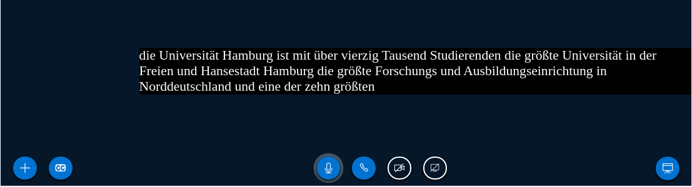

# BBB Kaldi Connector

This repository is the result of my master programm project at the [LT Group](https://github.com/uhh-lt) at the Univeristy of Hamburg.
The main goal of this project was to integrate a speech recognition pipeline into the [BigBlueButton Conference System](https://github.com/bigbluebutton/bigbluebutton).
It further allows to display recognized speech as closed captions in BBB's HTML5 client.

## Architecture


This project consists of three components that interact with some of the BBB components.
Most notably, Redis PubSub is used both for listening for newly created meetings as well as communication between this project's components.

### Audio Relay


For each new meeting, the Relay initializes a VoIP call to Freeswitch over SIP.
This results in an RTP connection that transfers mono OPUS 48kHz frames.
The frames are decoded into 16bit PCM samples that are published over pubsub in a meeting specific channel.

### Kaldi Model Server


This is a project by [UHH LT group](https://github.com/uhh-lt/kaldi-model-server).
The kaldi-start is a program that listens on redis for new meeting and then starts KMS with meeting specific channels for audio input and text output.

### MongoDB Connector


This component listens on PubSub for utterance messages by KMS, extracts the utterance and the corresponding meeting ID.
The BBB HTML5 client is built with Meteor.js which uses a MongoDB.
In the MongoDB, there is a document for each meeting and locale combination.
We update the respective document with the just received utterance and meteor.js can recognize the change and update its client through websockets.

#### BBB-HTML5 (Meteor.js)
To properly display captions inserted into the MongoDB a slightly modified version of html5 client needs to be used.
See the following two commits for reference:
* https://github.com/3wille/bigbluebutton/commit/6b066f4bbf53dfc1b6844a9d7a8134bd512f436c
* https://github.com/3wille/bigbluebutton/commit/2322054d922159ba9ef9a30ad269a709d3e3f320

## Setup & Usage

All three components need to be compiled with a Golang compiler that supports module (probably >=1.13).
In my setup I have the relay and mongo-connector running on the same server as BBB and Kaldi running on a different server.
Communication with KMS happens through Redis, so make sure that all have access to the same redis server.

Compile the binaries with:

```
go build audio_relay.go
go build kaldi-starter.go
go build kaldi_mongo_connector/kaldi_mongo_connector.go
```
If you are compiling for a server without glibc, consider usign ``CGO_ENABLED=0``.

If you have Golang installed on your server, you can also run the programs directly, e.g.:
```
go run kaldi-starter.go
```
Otherwise run the compiled binaries.

### Running Programs & Options

#### Relay
```
audio_relay bbb_secret_path_token sentry_url
```
* ``sentry_url``: I use sentry for error tracking, you can make an account, but removing the code should be easy as well
* ``bbb_secret_path_token`` is a path suffix used to circumvent BBB authorization. Append the following to ``/etc/bigbluebutton/nginx/sip.nginx``:

```
location /ws_BBB_SECRET_PATH_TOKEN {
        proxy_pass https://ip_address_as_above:7443;
        proxy_http_version 1.1;
        proxy_set_header Upgrade $http_upgrade;
        proxy_set_header Connection "Upgrade";
        proxy_read_timeout 6h;
        proxy_send_timeout 6h;
        client_body_timeout 6h;
        send_timeout 6h;

	error_log /var/log/nginx/bbb_websocket.log info;
}
```
#### MongoDB Connector
```
kaldi_mongo_connector sentry_url
```
* ``sentry_url``: I use sentry for error tracking, you can make an account, but removing the code should be easy as well
#### Kaldi Starter
```
kaldi-starter
```

To work, the starter of course needs a running version of [Kaldi Model Server](https://github.com/uhh-lt/kaldi-model-server).
That in turn, needs a running version of PyKaldi and Kaldi, please see the respective documentations on how to install those.
KMS also needs a model to work with, the respective settings yaml file can be set in https://github.com/3wille/bbb-kaldi-connector/blob/master/kaldi-starter.go#L38

## Results

When everything is working fine, you should be able to see Redis PubSub channels of this pattern ``asr_text_INTERNAL_MEETING_ID`` and on each of those channels messages with partial and complete utterances:

```
{
    "handle": "partialUtterance",
    "utterance": "die Universität Hamburg ist mit über vierzig Tausend Studierenden die größte
	Universität in der Freien und Hansestadt Hamburg die größte Forschungs und Ausbildungseinrichtung
in Norddeutschland und eine der zehn größten Hochschulen in",
    "key": "mic0-utt329-part52",
    "speaker": "speaker0",
    "time": 1751.2375078201294
}
```
```
{
    "handle": "completeUtterance",
    "utterance": "die Universität Hamburg ist mit über vierzig Tausend Studierenden die größte Universität in der Freien und Hansestadt Hamburg die größte Forschungs und Ausbildungseinrichtung in Norddeutschland und eine der zehn größten Hochschulen in Deutschland",
    "confidences": [0.9995377659797668, 1.0, 0.867841362953186, 0.8684811592102051, 0.9593820571899414, 1.0, 1.0, 0.9992160797119141, 1.0, 1.0, 1.0, 1.0, 1.0, 1.0, 1.0, 1.0, 0.9999002814292908, 1.0, 0.9989173412322998, 1.0, 1.0, 1.0, 0.997087836265564, 0.9883859157562256, 1.0, 1.0, 0.9992555379867554, 1.0, 1.0, 0.973842442035675, 0.9845209121704102, 1.0, 1.0, 1.0, 1.0, 0.9999350905418396, 1.0],
    "key": "mic0-utt443-part67",
    "speaker": "speaker0",
    "time": 2371.5270574092865
}
```
(text source: https://de.wikipedia.org/wiki/Universit%C3%A4t_Hamburg)

If you don't see this message, you can check on ``asr_audio_INTERNAL_MEETING_ID`` to see whether the problem is with the relay or kaldi.

When the MongoDB Connector is running, you should be able to see the CC button in the bottom-left corner of the client's main pane.
Once activated, the closed captions should show like

